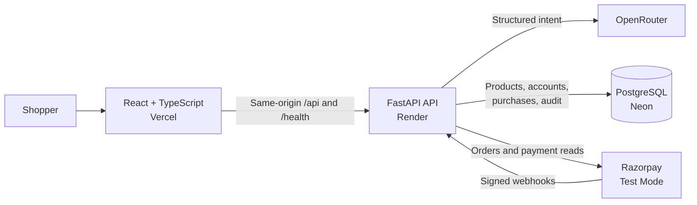

# Shopy

## Problem Statement

Shopping assistants can recommend products, but recommendation alone does not complete a trustworthy purchase. An autonomous commerce system must understand intent, select real inventory, respect a shopper's budget and approval rules, initiate payment safely, recover from uncertain provider responses, and explain every money-moving decision.

The challenge is to make a Razorpay merchant transactable through an AI-assisted buying experience without allowing the language model to become the authority for price, inventory, payment state, or user consent.

## Our Solution

**Shopy** is an end-to-end autonomous-commerce project built for Razorpay Track 01. It combines conversational product discovery with deterministic transaction controls and Razorpay Standard Checkout.

The AI interprets what the shopper wants and produces structured intent. Application-owned services then verify products, calculate quotes from trusted catalogue data, enforce account controls, reserve the purchase state, and create the payment order. Razorpay remains authoritative for payment outcomes, while signed webhooks and reconciliation handle delayed or ambiguous results. Every important transition is recorded for an explainable account and transaction history.

## Architecture



- **Frontend:** React, TypeScript, and Vite provide catalogue browsing, AI-assisted discovery, cart management, account controls, and checkout status.
- **API:** FastAPI owns validation, authentication, CSRF protection, product access, proposal creation, checkout orchestration, and reconciliation.
- **AI boundary:** OpenRouter helps parse shopping intent; it cannot set trusted prices, invent stock, approve spending, or declare a payment successful.
- **Commerce state:** SQLAlchemy and PostgreSQL on Neon store verified catalogue data, users, controls, proposals, provider orders, payments, webhook events, and audit evidence.
- **Payment authority:** Razorpay Test Mode creates orders and provides the authoritative payment state through verified callbacks, webhook signatures, and provider reads.
- **Hosting path:** Vercel serves the website and proxies browser API requests to Render, preserving a same-origin session and CSRF model.

Detailed design decisions and state-machine rules are documented in [`docs/architecture.md`](docs/architecture.md).

## Live Project

- **Website:** [https://shopy-ochre.vercel.app](https://shopy-ochre.vercel.app)
- **Backend API:** [https://shopy-zewo.onrender.com](https://shopy-zewo.onrender.com)
- **Interactive API documentation:** [https://shopy-zewo.onrender.com/docs](https://shopy-zewo.onrender.com/docs)
- **Service health:** [https://shopy-zewo.onrender.com/health](https://shopy-zewo.onrender.com/health)

> Payments run in Razorpay Test Mode. No live payment credentials are accepted by the application.

## How Shopy Works

1. The shopper describes a need or browses the verified product catalogue.
2. The assistant converts the request into structured shopping intent.
3. Deterministic services rank matching products and create a server-priced proposal.
4. Account controls enforce budget, category, quantity, and approval boundaries.
5. The backend creates a Razorpay order and opens Standard Checkout.
6. Callback verification, signed webhooks, and provider reads establish the payment result.
7. Reconciliation resolves uncertain outcomes without fabricating success or charging twice.
8. The account view exposes orders, transactions, controls, and audit-backed history.

## Core Capabilities

- Conversational product discovery backed by a verified catalogue
- Deterministic ranking and server-authoritative pricing
- Persistent cart, account profile, and shopping-agent controls
- Budget and approval guardrails before checkout
- Razorpay Standard Checkout integration in test mode
- Signature-verified callbacks and bounded webhook ingestion
- Idempotent provider-event processing and concurrency-safe payment records
- Monotonic captured-payment outcomes and explicit reconciliation states
- Tamper-evident audit-chain verification for transaction history
- Exact-origin CORS, HttpOnly sessions, CSRF protection, and separated signing secrets

## Authority and Safety Model

| Concern | Authority |
| --- | --- |
| Shopping intent | OpenRouter produces structured suggestions |
| Product, stock, and price | Verified Shopy catalogue and backend quote logic |
| Spending permission | Shopper-owned controls and deterministic validation |
| Order and payment facts | Razorpay responses, signatures, webhooks, and provider reads |
| Transaction history | PostgreSQL commerce records and verified audit chain |

Shopy treats timeouts and incomplete provider responses as uncertain—not as success or failure. Captured outcomes are monotonic, retries are narrowly bounded, webhook event IDs are tied to signed payload hashes, and no order-derived guess is allowed to overwrite an authoritative payment state.

## Technology Stack

| Layer | Technology |
| --- | --- |
| Web application | React 19, TypeScript, Vite |
| Backend API | Python 3.12, FastAPI, Pydantic |
| Persistence | PostgreSQL on Neon, SQLAlchemy 2, Alembic |
| AI integration | OpenRouter through an application-owned gateway |
| Payments | Razorpay Standard Checkout and webhooks |
| Hosting | Vercel frontend, Render backend |
| Security | Argon2, HttpOnly cookies, CSRF validation, HMAC signing, exact-origin CORS |

## Repository Structure

```text
Shopy/
├── backend/
│   ├── app/                 # FastAPI APIs, services, models, repositories, and gateways
│   ├── database/            # Alembic migrations and explicit catalogue operations
│   ├── scripts/             # Operational validation utilities
│   └── requirements.txt     # Fully pinned Python dependency graph
├── frontend/
│   ├── src/                 # React application and API client
│   └── vercel.json          # Live API and health rewrites
├── docs/
│   └── architecture.md      # Detailed product, security, and state-machine design
└── render.yaml              # Render service definition
```

## Project Principles

- The model may **propose**; deterministic code must **authorize**.
- Provider facts are validated before they become commerce state.
- Unknown payment outcomes remain unknown until reconciled.
- Captured purchases never regress because of a later stale or failed read.
- Secrets stay server-side and health responses expose no sensitive configuration.
- Every money-related decision should be bounded, observable, and explainable.
