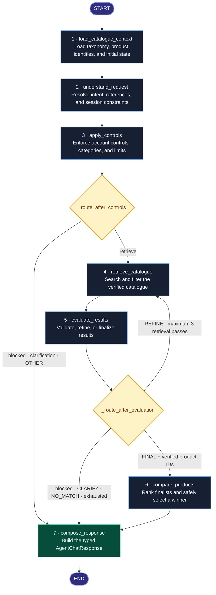
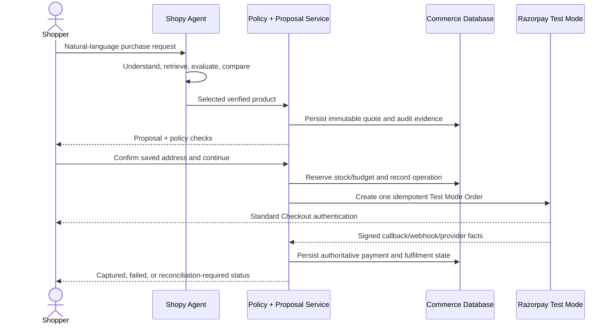

# Shopy Agent

### A governed AI shopping and commerce agent built for Razorpay AI Buildathon — Track 01

Shopy Agent is not just a chatbot that recommends products. It is an AI buyer that can understand a shopper’s request, research a live catalogue, compare real products, make a grounded recommendation, create a bounded purchase proposal, and take the shopper into Razorpay Test Mode Checkout.

I created a small merchant called **Shopy Limited** to prove that the agent works end to end. The storefront is the demonstration environment; the main project is the **AI Agent and its governed commerce flow**.

The central idea is simple:

> Let the AI reason about what the shopper wants, but never let the AI invent catalogue facts, control money, or declare a payment successful.

---

## Razorpay AI Buildathon — Problem Statement

### Track 01 — AI Growth & Agentic Commerce

#### Subtitle

**Grow the merchant’s revenue, and make them sellable to AI buyers**

#### Problem Statement

> Build an agent that grows revenue for a merchant on Razorpay test-mode APIs, or that makes a merchant transactable by an AI buyer end to end.

#### Why Now

> NPCI’s UAP and the global protocol race (ACP, AP2, x402) make agent-to-agent commerce the open problem of the year, and Razorpay’s in-app pilots are already live.

#### Example Directions

- Conversational in-app checkout
- Agent-readable catalog
- Upsell & cross-sell agent
- Campaign orchestrator

#### The Bar

> Every money action explainable, bounded and gated. Show the audit trail and one failure handled gracefully.

---

## What I Built

I built an end-to-end shopping agent that can take a request such as:

> “Buy me an iPhone 14. If it is not available, choose the latest iPhone currently available.”

The agent can then:

1. Understand that this is a purchase request, not a normal search.
2. Try the requested model first.
3. Resolve “latest available” as a valid fallback instead of entering a clarification loop.
4. Search only the merchant’s real, active, in-stock catalogue.
5. Compare verified candidates using their real identity, specifications, and price.
6. Apply the shopper’s saved limits and category controls.
7. Select one product and explain why it was chosen.
8. Create an immutable, short-lived purchase proposal using the server-authoritative price.
9. Ask the shopper to select and explicitly confirm a delivery address.
10. Create a genuine Razorpay Test Mode Order only after the shopper chooses to continue.
11. Let Razorpay handle payment authentication; the agent cannot pay by itself.
12. Record provider-confirmed payment state and fulfilment state.
13. Offer one relevant, catalogue-grounded cross-product suggestion as a separate optional checkout.
14. Record the important decisions in a tamper-evident audit trail.

This is what makes Shopy an **agentic commerce system** rather than a product recommendation demo.

---

## Why I Built a Shopy Merchant

The buildathon problem is about the agent, but an agent cannot demonstrate real commerce without a merchant, products, stock, prices, policies, orders, and payments.

I created Shopy Limited as a controlled merchant environment so that the agent can prove every stage of the flow:

- The catalogue gives the agent real products to research.
- Inventory proves that the agent cannot recommend unavailable products as purchasable.
- Merchant-owned prices prove that the model does not invent prices.
- Account controls prove that the agent’s authority is bounded.
- Razorpay Test Mode proves that the result can become a real payment request.
- Orders and transactions prove that provider facts are persisted.
- Audit history proves why each commerce action happened.

The storefront is therefore the **test merchant for the AI Agent**, not the primary innovation by itself.

---

## How Shopy Solves Track 01

| Track requirement | How Shopy solves it |
| --- | --- |
| Grow merchant revenue | The agent presents one relevant cross-product suggestion using merchant-authored category relationships. It is optional and creates a separate checkout. |
| Make a merchant sellable to AI buyers | The complete catalogue, policy, proposal, address, order, payment, and audit flow is accessible through the agent. |
| Conversational in-app checkout | A shopper can discover, compare, refine, select, and start checkout inside one persistent Agent workspace. |
| Agent-readable catalogue | Products have typed identity, category, stock, price, specifications, tags, source URL, and version information. |
| Upsell and cross-sell | The agent can compare alternatives and offer one grounded complementary product without silently bundling it. |
| Explainable money actions | Product selection, price, limits, proposal, order creation, payment status, and cross-sell decisions are recorded with reasons. |
| Bounded and gated | Limits are enforced by application code, and every Razorpay payment still requires explicit shopper confirmation. |
| Audit trail | Purchase runs use append-only, hash-linked audit entries for important state transitions. |
| Graceful failure | Unknown or ambiguous provider outcomes remain `PAYMENT_UNKNOWN` and reconcile against the same Razorpay Order instead of creating another charge. |

Shopy does not claim to implement every example direction. It focuses deeply on the most important combination for this track: **conversational checkout, an agent-readable catalogue, governed AI buying, and cross-selling for revenue growth**.

---

## The Shopy Agent Experience

### 1. The shopper speaks naturally

The shopper does not need to know catalogue filters or exact SKUs. Requests can include:

- A specific product: “Buy me an iPhone 16.”
- A use case: “I need a phone with a good camera under ₹70,000.”
- A comparison: “Compare the best options for gaming.”
- A refinement: “Show me a cheaper one.”
- A fallback: “If that model is unavailable, choose the latest available model.”
- A reference: “Buy the second option.”
- A normal greeting: “Hello, my name is Krishna.”

The agent returns a natural response, but its internal understanding is strict structured data.

### 2. The agent researches the catalogue

The agent reads the current category taxonomy and searches the complete active catalogue. It receives bounded candidates and diagnostics such as:

- How many products are in stock.
- Which categories matched.
- Which text fields matched.
- Which products remained eligible after price and policy filters.
- The lowest matching price.
- Why a search returned no honest result.

The LLM can reason over these facts, but it cannot add a product ID that was not supplied by the catalogue tool.

### 3. The agent compares verified products

The final comparison uses only supplied candidate data:

- Product identity
- Brand and model
- Specifications
- Tags and description
- Verified price
- Current stock eligibility
- The shopper’s use case and preferences

For “latest” or “newest” requests, the agent uses clearly ordered generation identifiers in verified product titles and model names. It does not invent release dates. If the exact generation is unavailable, the graph broadens the search to the same product family instead of asking the same clarification repeatedly.

### 4. The agent creates a governed proposal

A recommendation is not yet a payment. For a purchase request, the backend persists:

- One `PurchaseRun`
- One immutable `PurchaseQuote`
- One selected product
- One authoritative amount
- The product version used for selection
- The controls version used for policy checks
- The selection reason and comparison evidence
- A short expiry window

If the product, stock, version, category, or amount changes before persistence, the proposal is rejected as stale.

### 5. The shopper controls checkout

The shopper must:

1. Select a saved delivery address.
2. Explicitly confirm that address for this order.
3. Press the confirmation button.
4. Complete authentication inside Razorpay Standard Checkout.

The AI Agent cannot click the payment button, enter payment credentials, bypass Razorpay, or mark itself as paid.

### 6. The agent can grow the order value

Alongside the payment request, Shopy can show one relevant optional add-on. For example:

- Smartphone → headphones
- Laptop → headphones
- Tablet → headphones
- Headphones → speaker

These relationships are stored in the catalogue database. They are not invented by the LLM.

The candidate must still be:

- From the same merchant
- Active
- In stock
- Different from the original product
- Inside applicable price and category controls
- Connected through an active merchant-authored category relationship

If the shopper accepts the suggestion, Shopy creates a **new single-product proposal and a separate checkout** beneath the original checkout. It does not modify the first quote, silently bundle the item, or start another payment automatically. If the shopper declines it, that decision is recorded and the offer is hidden for that source run.

---

## The LangGraph Agent

The core shopping intelligence is implemented as a bounded LangGraph workflow. LangGraph gives the agent explicit stages, typed shared state, controlled branches, and a clear stopping point.



The diagram mirrors the implemented `StateGraph`: seven executable nodes, two conditional edge routers, one bounded refinement loop, and one terminal edge from `compose_response` to `END`.

### Graph stage 1 — Load catalogue context

The graph first loads active categories, aliases, facet definitions, and product counts. This means category understanding comes from the database rather than a hard-coded list inside the model prompt.

### Graph stage 2 — Understand the request

OpenRouter returns a strict `ShoppingUnderstanding` object containing information such as:

- Intent mode: `BUY`, `RECOMMEND`, `COMPARE`, `REFINE`, or `OTHER`
- Normalized request
- Search query
- Category slugs
- Budget relationship and amount
- Hard requirements
- Soft preferences
- Excluded terms and products
- Product references
- Clarification status
- A natural conversational reply for non-shopping messages

Every schema property is required. Nullable values must still be returned as `null`, which keeps the model boundary predictable.

Money is interpreted in INR at this stage. For example, “50k” becomes ₹50,000 and “1.2 lakh” becomes ₹1,20,000. Conversion to paise happens in trusted application code.

### Graph stage 3 — Apply deterministic controls

The graph combines the interpreted request with the shopper’s persisted controls:

- Agent enabled or disabled
- Recommendation price ceiling
- Per-purchase limit
- Daily spend limit
- Monthly spend limit
- Category allowlist
- Maximum recommendations
- Controls version

The LLM does not decide whether these limits may be ignored. Application code applies them.

### Graph stage 4 — Retrieve the catalogue

The repository searches across verified fields including SKU, brand, model, title, description, category, tags, and specifications.

Retrieval is bounded:

- At most 3 retrieval passes
- At most 40 accumulated candidates
- At most 8 final candidates
- Product exclusions remain excluded during refinement
- A maximum budget cannot be silently increased or removed
- Unknown categories are rejected

### Graph stage 5 — Evaluate and refine

The LLM sees only bounded search results and diagnostics. It chooses one of four actions:

- `FINAL` — enough relevant catalogue products exist
- `REFINE` — a safer or broader query can improve retrieval
- `CLARIFY` — the shopper genuinely needs to decide something
- `NO_MATCH` — no honest match exists

A refinement cannot loop forever. The graph records prior search plans, rejects repeated plans, and enforces the retrieval-pass limit.

Shopy also detects repeated clarification questions. A phrase such as “the latest one” resolves the previous latest-available fallback, and the same model question is not asked endlessly.

### Graph stage 6 — Compare products

The comparison model receives only eligible products. It selects one supplied ID, produces a ranked list of supplied IDs, explains the winner, and records trade-offs.

Application code validates that every returned identifier belongs to the candidate set. A fabricated ID blocks the decision.

### Graph stage 7 — Compose the response

The final response is typed and can contain:

- Natural reply
- Intent and decision sources
- Recommendations
- Winner
- Comparison evidence
- Clarification options
- Search diagnostics
- Exact-match status
- Purchase proposal
- Conversation and turn IDs
- Outcome such as `RECOMMENDATIONS`, `CLARIFICATION`, `CONVERSATION`, `NO_MATCH`, or `BLOCKED`

This response drives the Agent workspace without allowing unstructured model text to become commerce state.

---

## LLM Responsibilities vs Application Responsibilities

A core design decision was separating **semantic intelligence** from **commercial authority**.

| Concern | LLM responsibility | Trusted application responsibility |
| --- | --- | --- |
| User language | Understand meaning, intent, references, and preferences | Validate the structured result |
| Catalogue | Evaluate supplied candidates | Own product identity, stock, category, version, and price |
| Budget | Interpret phrases such as “under 50k” | Convert units and enforce ceilings |
| Recommendation | Compare verified products and explain trade-offs | Reject unknown IDs or ineligible products |
| Cross-sell | Explain why a supplied add-on may help | Define relationships and enforce eligibility |
| Purchase | Suggest one selected product | Create immutable proposal and policy snapshot |
| Payment | Explain the next step | Create Razorpay Order only after shopper confirmation |
| Payment status | None | Trust verified Razorpay facts only |
| Audit | Produce human-readable reasoning | Persist append-only, hash-linked evidence |

This boundary prevents a language-model hallucination from becoming a money action.

---

## Conversation Memory and Natural Interaction

Signed-in shoppers receive persistent Agent sessions. Each turn stores:

- User message
- Assistant reply
- Typed Agent response
- Sequence number
- Current focus product
- Conversation version

Only bounded recent turns and the profile display name are sent as ephemeral context to the LLM. Account PII is not copied into conversation state just to personalize a greeting.

The frontend uses a version-aware conversation cache with cancellation and stale-response guards. This makes switching sessions feel immediate while preventing an old network response from replacing a newer conversation.

The microphone supports longer requests through:

- Continuous recognition
- Interim transcript display
- Three-second silence detection
- Manual stop
- Sixty-second maximum capture
- Safe restart when the browser ends recognition unexpectedly
- Exactly one submission when graceful recognition ends

Destructive actions such as switching conversations or closing the workspace abort recognition without submitting partial speech.

---

## Governed Commerce Flow

The LangGraph workflow ends with a recommendation. A separate commerce layer turns an approved recommendation into a Razorpay checkout.



### Immutable quote

The proposal snapshots the selected product, amount, quantity, controls version, decision source, selection reason, and expiry. Checkout uses this snapshot instead of asking the LLM for a price again.

### Idempotent order creation

Each checkout operation uses an idempotency key and a persisted provider-operation record. A browser retry cannot freely create another Razorpay Order for the same operation.

### Explicit address confirmation

A saved address is not silently reused. The shopper must confirm it for the specific Agent order.

### Provider-authoritative payment

A signed browser callback is not treated as sufficient on its own. The backend verifies ownership and signature, fetches current provider facts, checks order ID, amount, currency, and quote ownership, and then updates commerce state.

### No autonomous payment

The Agent can prepare a transaction, but the shopper owns the final payment action in Razorpay Checkout. Shopy does not store payment credentials and does not simulate consent.

---

## Purchase State and Safety

A purchase moves through controlled states instead of one unstructured “success” flag. Important stages include:

- Request received
- Intent parsed
- Catalogue searching
- Product selected
- Quote created
- Razorpay Order creation
- User authentication required
- Payment initiated
- Payment captured
- Payment failed
- Payment unknown

Transitions are validated. Once a payment is authoritatively captured, a later stale or failed read cannot regress it to unpaid.

Before checkout, the backend rechecks:

- Proposal ownership
- Proposal expiry
- Product activity
- Product version
- Current stock
- Current amount
- Current controls version
- Per-purchase limit
- Daily and monthly captured spend
- Active reservations
- Delivery-address ownership

This is how the Agent remains useful without becoming financially unsafe.

---

## Explainability and Audit Trail

Every important purchase run can produce audit entries containing:

- Actor: shopper, Agent, system, or Razorpay
- Action
- Outcome
- Human-readable explanation
- Structured evidence
- Previous entry hash
- Current entry hash
- Optional HMAC signature
- Timestamp

The chain starts from a known zero hash. Each new entry includes the previous hash, which makes silent modification detectable.

Examples of audited events include:

- Product selected and quoted
- Policy allowed or denied
- Razorpay Order creation
- Payment state updates
- Provider fact mismatch
- Payment unknown
- Cross-sell accepted
- Cross-sell declined

The audit trail is not generated from a chat transcript after the fact. It is recorded while the commerce state changes.

---

## Graceful Failure Handling

The buildathon asks for one failure handled gracefully. Shopy handles several, but the clearest example is an uncertain provider response.

### Example: payment status cannot be confirmed

If the Razorpay payment read times out or returns an ambiguous result:

1. Shopy does not claim success.
2. Shopy does not claim definite failure.
3. The run becomes `PAYMENT_UNKNOWN`.
4. The shopper is warned not to start another charge.
5. The existing Razorpay Order is reconciled.
6. Current provider order and payment facts are fetched again.
7. The same run is updated only after those facts are verified.
8. The event is added to the audit chain.

This avoids the dangerous failure mode where a timeout causes a second payment request even though the first payment may have succeeded.

Other handled failures include:

- Product changes before quote persistence
- Quote expiry
- Stock changes before checkout
- Address ownership mismatch
- Razorpay Order facts not matching the immutable quote
- Invalid checkout signatures
- Duplicate webhook delivery
- Reused webhook event ID with a different signed body
- Browser checkout dismissal
- LLM response containing an unknown product or category
- Repeated search or clarification loops

---

## Revenue Growth Without Dark Patterns

Cross-selling can increase merchant revenue, but it can also become annoying or manipulative. I intentionally constrained Shopy’s behavior:

- Only one add-on is shown.
- The relationship comes from merchant-owned catalogue data.
- The original purchase remains unchanged.
- The add-on price and stock are independently verified.
- Accepting creates a separate proposal, not a hidden bundle.
- A second Razorpay Order is not created until the shopper confirms that separate checkout.
- Declining permanently hides the offer for that source run.
- Both acceptance and decline are auditable.

The goal is to create a helpful revenue opportunity without interrupting or pressuring the shopper.

---

## Agent-Readable Catalogue

The catalogue is designed as a tool the Agent can safely use. A product includes:

- Stable product ID
- Merchant ID
- SKU
- Brand
- Model
- Category
- Title and description
- Offer price and optional MRP
- Inventory quantity
- Active status
- Structured specifications
- Search tags
- Source URL
- Verification timestamp
- Optimistic-lock version

Categories are also database-authored and include display names, aliases, descriptions, facets, and ordering.

Cross-product category relationships are stored separately with source category, target category, relationship type, benefit text, priority, and active status.

Product descriptions and conversation messages are treated as untrusted data in model prompts. They cannot instruct the Agent to ignore policy or invent a payment result.

---

## Main Capabilities

- Persistent conversational shopping sessions
- Natural profile-aware greetings
- Long-form microphone input
- Full-catalogue product discovery
- Product comparison and trade-off explanation
- Exact model, budget, category, and preference handling
- Latest-available fallback without clarification loops
- Shopper-owned Agent controls
- Immutable server-priced purchase proposals
- Saved-address selection and explicit per-order confirmation
- Razorpay Standard Checkout in Test Mode
- Signature verification and provider-fact validation
- Signed webhook processing and deduplication
- Payment reconciliation without duplicate charging
- Merchant-authored cross-product suggestions
- Separate add-on proposals and checkouts
- Order, transaction, run, and audit history
- Hash-linked audit evidence

---

## Technology Used

| Layer | Technology |
| --- | --- |
| Agent orchestration | LangGraph |
| LLM reasoning | OpenRouter structured-output gateway |
| API | Python 3.12, FastAPI, Pydantic |
| Persistence | PostgreSQL, SQLAlchemy 2, Alembic |
| Payments | Razorpay Standard Checkout, callbacks, webhooks, provider reads |
| Web application | React 19, TypeScript, Vite |
| Authentication and security | HttpOnly sessions, CSRF protection, Argon2, HMAC signing |
| Validation | Ruff, mypy, TypeScript compiler, production frontend build |

---

## Repository Structure

```text
Shopy/
├── backend/
│   ├── app/
│   │   ├── agents/          # LangGraph shopping workflow
│   │   ├── api/             # Agent, catalogue, checkout, account, and order APIs
│   │   ├── domain/          # Money and purchase-state rules
│   │   ├── gateways/        # OpenRouter and Razorpay boundaries
│   │   ├── models/          # SQLAlchemy persistence models
│   │   ├── repositories/    # Authoritative reads, search, and audit persistence
│   │   ├── schemas/         # Strict Pydantic API and LLM contracts
│   │   └── services/        # Proposal, checkout, payment, and order orchestration
│   └── database/
│       ├── data/            # Verified catalogue source data
│       ├── migrations/      # Alembic schema and compatibility changes
│       └── scripts/         # Explicit catalogue seeding operations
├── frontend/
│   └── src/
│       ├── agent/           # Agent workspace and governed checkout UI
│       ├── api.ts           # Typed backend client
│       └── types.ts         # Shared frontend contracts
└── README.md
```

---

## Suggested Buildathon Demonstration

A judging walkthrough can show the full problem statement in one flow:

1. Open Shopy Agent and start a new session.
2. Ask for a product with a budget and use case.
3. Ask for an unavailable exact model with a latest-available fallback.
4. Show the LangGraph-backed Agent selecting a verified alternative without repeating a clarification.
5. Inspect the recommendation reason, price, and policy checks.
6. Open the governed purchase proposal.
7. Show the optional complementary product suggested from catalogue-authored relationships.
8. Accept it and show that it creates a separate checkout while preserving the original purchase.
9. Confirm a saved delivery address for the original order.
10. Continue to Razorpay Test Mode Checkout and complete shopper authentication.
11. Show the resulting order and transaction state.
12. Open the run’s audit history and explain the decision chain.
13. Demonstrate a dismissed or uncertain payment and reconcile the same Razorpay Order rather than creating another charge.

This demonstrates revenue growth, agent-readable commerce, bounded money actions, user gating, auditability, and graceful failure handling in one coherent story.

---

## What Makes Shopy Different From a Normal Shopping Chatbot

A normal shopping chatbot can say, “I recommend this phone.”

Shopy can explain:

- Which catalogue records were considered
- Why a product was eligible
- Which constraints were applied
- Why one product won
- Which product version and price were quoted
- Whether checkout is currently allowed
- Which address the shopper confirmed
- Which Razorpay Order belongs to the quote
- What Razorpay currently says about the payment
- Why an add-on was offered
- Who accepted or declined it
- How an uncertain payment was reconciled

Most importantly, Shopy can turn a conversation into a real, bounded, shopper-approved Razorpay transaction without allowing the LLM to become the source of financial truth.

---

## Scope and Honest Boundaries

- Payments use Razorpay Test Mode APIs.
- The Agent does not autonomously complete payment authentication.
- One purchase proposal contains one product and quantity one.
- Optional add-ons use their own proposal and checkout.
- Catalogue facts are limited to merchant-verified data.
- “Latest” is selected only when verified model or generation identifiers are clearly comparable.
- The project demonstrates agentic commerce; it does not claim protocol-level implementation of UAP, ACP, AP2, or x402.
- Shopy Limited is the demonstration merchant built to prove the Agent’s end-to-end capabilities.

---

## Final Track 01 Fit

Shopy fits Track 01 in both parts of the challenge:

### It grows merchant revenue

The Agent creates an explainable cross-selling opportunity using real catalogue relationships, current stock, current prices, and shopper controls. The suggestion remains optional and requires a separate shopper-confirmed payment.

### It makes a merchant transactable by an AI buyer end to end

The Agent can move from natural language to catalogue research, product selection, policy enforcement, immutable quote, delivery confirmation, Razorpay Test Mode Order creation, payment verification, fulfilment state, reconciliation, and audit evidence.

The AI provides the intelligence. The application provides the boundaries. Razorpay provides payment authority. The shopper keeps final control.

That combination is the core of **Shopy Agent**.
