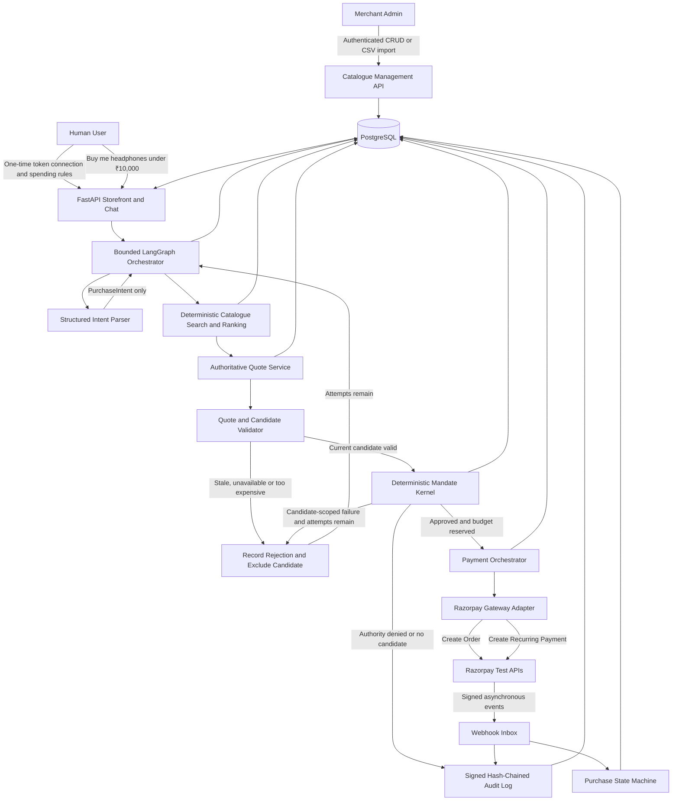
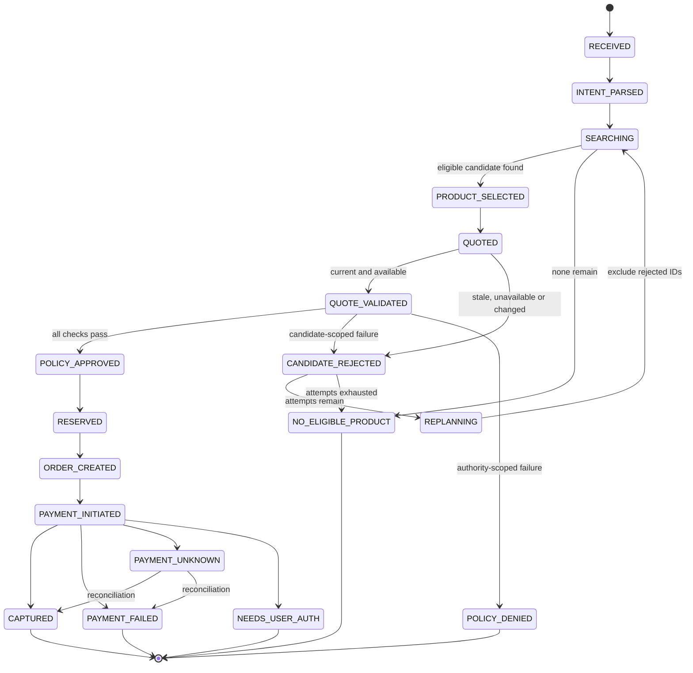

# Shopy — Autonomous AI Commerce Gateway

> Implementation-ready architecture for Razorpay AI Buildathon Track 01: AI Growth & Agentic Commerce  
> Stack: FastAPI + PostgreSQL | Team: Solo developer | Build window: 2 days  
> Research date: 3 September 2026

---

## 1. Executive Summary

**Shopy** lets an AI buyer autonomously purchase from a Razorpay merchant while a deterministic control layer—not the LLM—enforces the user's signed spending mandate.

The application executes a complete production-shaped commerce flow against Razorpay test-mode APIs:

1. A merchant manages real technology products, offer prices and inventory through authenticated catalogue APIs or an idempotent CSV import.
2. A human performs one-time recurring-payment authorization and sets spending rules.
3. The human asks the agent to buy a product.
4. The LLM converts the request into structured intent but cannot spend money.
5. A bounded LangGraph workflow searches and deterministically ranks eligible products from the merchant's current PostgreSQL catalogue.
6. An authoritative quote freezes the selected product's price and inventory version.
7. If that candidate becomes stale, too expensive or unavailable before payment, the graph rejects it, excludes it and searches for the next-best valid alternative while preserving the user's constraints.
8. A non-LLM mandate kernel checks every spending rule and atomically reserves budget and inventory.
9. Only an approved candidate can create a Razorpay Order and recurring payment using the confirmed saved token.
10. A verified Razorpay webhook finalizes the purchase.
11. Every candidate attempt, decision and external action is written to a signed, hash-chained audit trail.

The unique contribution is not another conversational checkout. It is a **real merchant-side agentic-commerce system with bounded recovery, deterministic authorization and verifiable evidence** between AI agents and Razorpay.

---

## 2. Problem Statement

### Track 01 — AI Growth & Agentic Commerce

> Build an agent that grows revenue for a merchant on Razorpay test-mode APIs, or that makes a merchant transactable by an AI buyer end to end.

### Required bar

Every money action must be:

- **Explainable:** show why the product and payment were selected.
- **Bounded:** enforce category, amount, transaction-count, cumulative-budget and expiry limits.
- **Gated:** receive deterministic policy approval before any Razorpay write.
- **Auditable:** retain a tamper-evident timeline of decisions and actions.
- **Failure-safe:** reject, pause or reconcile safely without double charging.

### Chosen direction

Make a merchant transactable by an AI buyer end to end using a saved Razorpay recurring-payment method. The purchase after initial authorization should require no human interaction while it remains within the mandate.

---

## 3. Confirmed Requirements

- Focused, production-shaped vertical slice rather than full ACP, UCP, AP2, MCP or x402 implementations.
- Real saved-payment autonomous flow using Razorpay test-mode APIs; no fabricated provider IDs, webhook outcomes or runtime mock fallback.
- Razorpay customer/token/recurring-payment access is verified.
- Razorpay test credentials and an LLM API key are available.
- Python FastAPI backend with PostgreSQL persistence.
- A single merchant with authenticated catalogue management; multi-merchant marketplace behavior is out of scope.
- An initial catalogue of exactly 100 real technology product models: 20 smartphones, 20 speakers, 20 headphones/earbuds, 20 laptops and 20 tablets.
- Real product identities and specifications must be traceable to manufacturer sources. Prices and inventory are merchant-owned commercial data, not scraped marketplace claims.
- Products are imported into PostgreSQL and remain editable through CRUD and CSV import; they are never hardcoded into Python.
- LangGraph provides a bounded ReAct-style orchestration loop. Candidate recovery is allowed only before a Razorpay write and never bypasses deterministic policy.
- Test doubles exist only in automated tests and can never be selected by deployed runtime configuration.
- Solo developer and two development days, so breadth is constrained but the implemented vertical slice must be genuine.
- A lightweight server-rendered dashboard rather than a separate frontend application.

---

## 4. Research Conclusions

Official Razorpay documentation confirms this autonomous recurring-payment lifecycle:

1. The customer performs a one-time authorization transaction.
2. Razorpay tokenizes the payment method.
3. The application retrieves the token and verifies that recurring payment is enabled and `recurring_details.status` is `confirmed`.
4. Every subsequent charge requires a fresh Razorpay Order.
5. The application calls `POST /v1/payments/create/recurring` using the order, customer and token.
6. The immediate response supplies a payment identifier but must not be treated as final settlement proof.
7. A verified webhook or an authoritative payment fetch determines the final state.

A subsequent recurring-payment request includes:

```json
{
  "email": "buyer@example.com",
  "contact": "+919000000000",
  "amount": 89900,
  "currency": "INR",
  "order_id": "order_...",
  "customer_id": "cust_...",
  "token": "token_...",
  "recurring": true,
  "description": "Agent purchase for run run_...",
  "notes": {
    "run_id": "run_...",
    "mandate_id": "mnd_...",
    "quote_hash": "sha256:..."
  }
}
```

### Critical constraints

- Recurring Payments is an on-demand Razorpay feature.
- A token must be confirmed before autonomous use.
- Rail-level token restrictions include expiry and maximum debit amount.
- Charges outside permitted limits can require Additional Factor Authentication.
- If Razorpay requests OTP, redirect or another authentication step, the agent must stop at `NEEDS_USER_AUTH`; it must never automate or bypass authentication.
- Webhooks can be duplicated and delivered out of order.
- Webhook HMAC verification must use the raw request body.
- `x-razorpay-event-id` should be the webhook deduplication key.
- A timed-out payment POST must not be blindly retried. The system must first query the order/payment state to prevent duplicate charging.
- Amounts must remain integer paise throughout the system.
- The application must use test keys and reject `rzp_live_` keys at startup.

### Razorpay integration decision

Use a direct Razorpay gateway adapter for `POST /v1/orders` and `POST /v1/payments/create/recurring`. Do not place the official Razorpay MCP server on the core payment path for this INR recurring flow. MCP can be added later as an input adapter.

### Sources

- [Razorpay Recurring Payments](https://razorpay.com/docs/payments/payment-gateway/s2s-integration/recurring-payments/)
- [Create Subsequent Card Payments](https://razorpay.com/docs/payments/payment-gateway/s2s-integration/recurring-payments/cards/subsequent-payments/)
- [Fetch and Manage Tokens](https://razorpay.com/docs/payments/payment-gateway/s2s-integration/recurring-payments/cards/tokens/)
- [Standard Checkout Integration](https://razorpay.com/docs/payments/payment-gateway/web-integration/standard/integration-steps/)
- [Webhook Validation and Testing](https://razorpay.com/docs/webhooks/validate-test/)
- [Official Razorpay MCP Payment Source](https://github.com/razorpay/razorpay-mcp-server/blob/main/pkg/razorpay/payments.go)

Content derived from external sources was rephrased for licensing compliance.

---

## 5. Architectural Principles

1. **The LLM parses and proposes; deterministic code searches, ranks and authorizes.**
2. **LangGraph controls a bounded workflow, not an unrestricted autonomous payment agent.**
3. **No Razorpay write can bypass the mandate kernel.**
4. **Commercial truth comes from the merchant database, not model output or scraped marketplace state.**
5. **Recoverable candidate failures replan before payment; uncertain provider outcomes reconcile and never replan.**
6. **Rejected candidates are excluded so the graph cannot repeat the same failed choice.**
7. **All money is represented as integer paise.**
8. **Budget and inventory are reserved atomically before an external payment call.**
9. **Payment creation and payment completion are separate states.**
10. **Unknown payment state is reconciled, never blindly retried.**
11. **Every decision is explainable from stored facts and rule outcomes.**
12. **Sensitive credentials and token identifiers never enter LLM context.**
13. **Runtime behavior uses real PostgreSQL and Razorpay test APIs; fakes are restricted to tests.**
14. **Protocol support remains an adapter concern rather than contaminating the commerce core.**

---

## 6. System Architecture

Use a **production-shaped modular monolith**: one FastAPI application, one PostgreSQL database and one lightweight Jinja/HTMX interface. This preserves transactional integrity and operational simplicity without introducing microservices, queues or a separate SPA before they are justified.



### Protocol-ready ports

Only interfaces that are used by the current implementation should be created:

```text
BuyerChannel
  └── ChatBuyerChannel now
      ├── ACP adapter later
      └── MCP adapter later

PaymentRail
  └── RazorpayRecurringRail now
      └── UAP / Reserve Pay adapter later
```

The core receives structured purchase intent and returns purchase state. It does not need to know which future protocol supplied the intent.

---

## 7. Component Design

### 7.1 Merchant and Buyer Interface

Serve a compact production-shaped interface from FastAPI using Jinja templates plus HTMX or minimal JavaScript.

#### Merchant catalogue panel

- Authenticated product create, read, update, activate/deactivate and inventory adjustment
- Idempotent CSV import with validation report and per-row errors
- Current offer price and inventory controlled by the merchant
- Product source URL, specification verification date and image provenance
- Product version history sufficient to explain quote invalidation

#### Mandate panel

- Existing Razorpay customer ID
- Confirmed token selection
- Per-transaction limit
- Cumulative budget
- Allowed categories
- Maximum transaction count
- Mandate expiry
- Activate and revoke controls

#### Agent panel

- Natural-language purchase command
- Parsed structured intent and substitution permission
- Ranked candidates and deterministic score breakdown
- Rejected candidates, rejection reasons and replan count
- Selected product and authoritative quote
- Live policy checks
- Razorpay Order and Payment IDs
- Current purchase state

#### Audit panel

- Chronological event timeline
- Rule-by-rule decisions
- Every candidate attempted by the graph
- Redacted Razorpay request/response evidence
- Audit-chain verification status
- Explicit `razorpay_calls_made: 0` evidence when no candidate is authorized

### 7.2 Structured Intent and Bounded LangGraph Agent

The LLM only converts user language into a Pydantic-validated object:

```json
{
  "query": "wireless headphones",
  "category": "headphones",
  "quantity": 1,
  "max_price_paise": 1000000,
  "preferences": ["active noise cancellation", "good battery life"],
  "exact_product": null,
  "allow_substitution": true
}
```

LangGraph orchestrates a bounded ReAct-style tool loop with explicit nodes:

```text
parse_intent
  → search_catalog
  → select_candidate
  → create_quote
  → validate_quote
  → evaluate_mandate
  → reserve_budget_and_inventory
  → create_order
  → create_payment
  → await_or_reconcile_result
```

Persistent graph state contains at least:

```text
run_id, intent, candidate_ids, rejected_candidates,
current_candidate_id, current_quote_id, attempt_count,
max_replans, policy_decision, provider_write_started,
payment_state, terminal_reason
```

Conditional routing rules:

1. A stale price, insufficient stock, deactivated product or candidate-scoped amount failure records `CANDIDATE_REJECTED` and returns to catalogue search.
2. Search excludes all rejected product IDs and preserves category, maximum price, quantity and requested features.
3. The workflow permits at most three replanning attempts after the initial candidate. Exhaustion produces `NO_ELIGIBLE_PRODUCT`.
4. A generic request can substitute products. An exact-model request can substitute only when `allow_substitution=true`.
5. Revoked/expired mandates, invalid signatures, exhausted cumulative authority, disallowed categories and unusable payment tokens produce terminal `POLICY_DENIED` rather than replanning.
6. No candidate loop is permitted after `provider_write_started=true`. `PAYMENT_UNKNOWN` always routes to reconciliation so another product cannot be charged accidentally.
7. State is checkpointed to PostgreSQL after every node so a process restart resumes the same run rather than starting a duplicate purchase.

Additional safety rules:

- The LLM receives no Razorpay key, customer ID or token ID.
- The LLM has no direct network, database or payment tool.
- Invalid structured output is rejected rather than guessed.
- Product descriptions and imported catalogue content are untrusted input.
- Model reasoning may explain a proposal but cannot rank authoritatively or authorize it.
- Automated tests use a fake LLM adapter; deployed runtime configuration cannot select it.

### 7.3 Real Merchant Catalogue and Deterministic Ranker

The initial catalogue contains exactly **100 real technology product models**:

| Category | Initial count |
|---|---:|
| Smartphones | 20 |
| Speakers | 20 |
| Headphones and earbuds | 20 |
| Laptops | 20 |
| Tablets | 20 |
| **Total** | **100** |

These 100 records are an initial import, not a product limit. The production catalogue is stored in PostgreSQL and managed through authenticated CRUD and CSV import. Products must never be embedded as Python constants or silently recreated at startup.

Every imported product includes:

- Merchant ID and unique merchant SKU
- Real brand, model and normalized category
- Title and factual description
- Merchant offer price and optional MRP in integer paise
- Merchant-controlled inventory quantity and active status
- Structured specifications appropriate to its category
- Search tags and normalized attributes
- Image metadata or an image URL whose use is permitted
- Manufacturer or authoritative source URL
- `specifications_verified_at`, `created_at` and `updated_at`
- Monotonically increasing product version

“Real” has a precise boundary: model identity and specifications are verified against an authoritative manufacturer source; offer price and inventory are assertions made by this merchant. The system does not scrape Amazon or another marketplace and misrepresent their volatile price, availability, ratings or reviews as merchant data. Ratings and reviews are omitted unless a genuine licensed source is later integrated.

The versioned CSV import must:

1. Validate the schema and normalized category.
2. Require a unique SKU, positive price, non-negative stock, source URL and verification timestamp.
3. Verify that the initial file contains exactly 20 records in each required category.
4. Upsert idempotently by `(merchant_id, sku)`.
5. Increment product version when commercial or specification fields change.
6. Produce an import report without partially applying an invalid file.

Product selection remains reproducible:

1. Filter active products from the merchant's current database state.
2. Match the normalized requested category.
3. Require sufficient available inventory after existing reservations.
4. Apply the effective price ceiling: the minimum of the user's request, mandate per-transaction cap and remaining mandate budget.
5. Exclude candidates already rejected in this graph run.
6. Score explicit product specifications, price fit and requested preference tags with a documented deterministic formula.
7. Use a stable SKU tie-breaker and return the complete score breakdown.

The LLM may parse preferences, but PostgreSQL fields and deterministic scoring establish product eligibility and ordering.

### 7.4 Authoritative Quote Service

A quote freezes commercial truth before authorization:

- Product ID, merchant SKU and product version
- Unit price in paise
- Quantity
- Tax and fee values, if used
- Total in paise
- Inventory snapshot
- Creation and expiry timestamps
- SHA-256 hash of canonical quote data

Immediately before budget reservation, re-read and lock the product. If price, stock, active status or version has changed, do not reserve funds and make no Razorpay call. Record the old and current values, mark that candidate `CANDIDATE_REJECTED`, and route the LangGraph run back to catalogue search when attempts remain. Every alternative receives a fresh quote and full policy evaluation; an old quote is never modified in place.

### 7.5 AP2-Inspired Mandate

This is an AP2-inspired signed spending envelope, not a claim of AP2 compliance.

```json
{
  "mandate_id": "mnd_...",
  "user_id": "usr_...",
  "merchant_id": "merchant_...",
  "currency": "INR",
  "max_per_transaction": 100000,
  "max_total_amount": 200000,
  "max_transactions": 2,
  "allowed_categories": ["headphones"],
  "issued_at": "2026-09-03T10:00:00Z",
  "expires_at": "2026-09-04T10:00:00Z",
  "status": "active",
  "nonce": "..."
}
```

The server signs canonical mandate JSON using HMAC-SHA256 and a dedicated mandate-signing secret. The linked payment instrument is stored separately so the signed mandate never contains a usable token.

### 7.6 Deterministic Mandate Kernel

The policy engine is ordinary Python code with no LLM calls. It checks, in order:

1. Mandate signature is valid.
2. Mandate status is active and not revoked.
3. Mandate has not expired.
4. Linked token is active, unexpired and confirmed for recurring use.
5. Merchant is permitted.
6. Product category is allowed.
7. Per-transaction amount is within the mandate.
8. Cumulative spent plus reserved amount remains within budget.
9. Transaction count remains within its limit.
10. Quote has not expired.
11. Quote hash and current product version match.
12. Inventory remains available.
13. Idempotency key belongs to this persisted run and no conflicting run or provider operation exists.

Each check emits:

```json
{
  "rule": "max_per_transaction",
  "result": "PASS",
  "observed": 89900,
  "limit": 100000,
  "explanation": "₹899.00 is within the ₹1,000.00 transaction limit."
}
```

A failed check is classified rather than handled uniformly:

- **Candidate-scoped and recoverable before payment:** stale quote, unavailable inventory or a candidate amount above the effective ceiling. Record the complete decision, make no Razorpay call and route to `CANDIDATE_REJECTED` for bounded replanning.
- **Authority-scoped and terminal:** invalid signature, revoked/expired mandate, disallowed category, exhausted total/count authority or unusable payment token. Produce `POLICY_DENIED` and stop.
- **Provider-uncertain after a write:** produce `PAYMENT_UNKNOWN` and reconcile the existing order/payment. Never select or charge an alternative product.

### 7.7 Atomic Budget and Inventory Reservations

Prevent concurrent requests from spending the same budget:

1. Begin a PostgreSQL transaction.
2. Lock the existing purchase run by its idempotency key.
3. Lock the mandate row with `SELECT ... FOR UPDATE`.
4. Lock the selected product row.
5. Re-evaluate quote validity and policy against current values.
6. Insert one budget/inventory reservation linked to the existing run.
7. Increase `reserved_amount` and reserve inventory.
8. Persist the run as `RESERVED` and checkpoint the graph state.
9. Commit.
10. Set `provider_write_started` durably before issuing the first Razorpay POST, then call Razorpay only from that persisted state.

Finalization rules:

- `CANDIDATE_REJECTED`: do not create a reservation; persist the rejection and return to search only when attempts remain.
- `NO_ELIGIBLE_PRODUCT` or `POLICY_DENIED`: do not create a reservation and terminate with an explanation.
- `CAPTURED`: move amount from reserved to spent and consume inventory.
- `PAYMENT_FAILED`: release budget and inventory; do not purchase an alternative automatically after a provider write.
- `PAYMENT_UNKNOWN`: retain the reservation until reconciliation resolves the outcome.

### 7.8 Razorpay Gateway Adapter

Expose a narrow application-facing interface:

```text
verify_recurring_token(customer_id, token_id)
create_order(amount, receipt, notes)
create_recurring_payment(order_id, customer_id, token_id, amount)
fetch_payment(payment_id)
fetch_order_payments(order_id)
```

Implementation requirements:

- `httpx.AsyncClient`
- Basic authentication loaded only from environment variables
- Base URL fixed to `https://api.razorpay.com`
- Explicit connection and response timeouts
- No automatic retry for payment-creating POST requests
- Retries allowed only for safe reads with bounded backoff
- Redacted structured logs
- `run_id`, `mandate_id` and `quote_hash` stored in Razorpay notes
- Token IDs encrypted at rest and redacted everywhere else

### 7.9 Purchase and Agent State Machine



`CANDIDATE_REJECTED` and `REPLANNING` exist only before any Razorpay write. `NEEDS_USER_AUTH` is a successful enforcement of the boundary, not an invitation to bypass authentication. Every state transition is persisted and guarded by the run's idempotency key.

### 7.10 Webhook Inbox

Webhook processing must:

1. Read raw request bytes.
2. Verify the `X-Razorpay-Signature` HMAC-SHA256.
3. Reject invalid signatures.
4. Insert `x-razorpay-event-id` into a uniquely constrained inbox table.
5. Acknowledge already-processed duplicates without processing twice.
6. Apply events through valid state transitions.
7. Ignore state regressions caused by out-of-order events.
8. Audit accepted, duplicate, ignored and rejected events.

Webhooks are authoritative for asynchronous automation. If the UI needs immediate confirmation before a webhook arrives, perform a bounded payment fetch.

### 7.11 Reconciliation

If order or payment creation times out after the request may have reached Razorpay:

1. Mark the run `PAYMENT_UNKNOWN`.
2. Do not retry the charge.
3. Fetch payments associated with the stored Razorpay Order.
4. If a payment exists, attach it and resolve its state.
5. If no payment exists after the reconciliation window, mark failed and release reservations.
6. Audit every reconciliation attempt and result.

### 7.12 Tamper-Evident Audit Log

Every significant action creates an append-only entry containing:

- Sequence number
- Timestamp
- Actor: human, agent, policy engine, Razorpay or system
- Action
- Decision
- Explanation
- Redacted metadata
- Previous entry hash
- Current entry hash
- HMAC signature

```text
entry_hash = SHA256(previous_hash || canonical_entry_json)
entry_signature = HMAC(AUDIT_SIGNING_SECRET, entry_hash)
```

A verification endpoint recomputes and validates the chain. The dashboard should visibly report:

```text
Audit chain valid: 24/24 entries verified
```

Use separate secrets for mandate signing, audit signing, Razorpay API authentication and Razorpay webhook verification.

---

## 8. PostgreSQL Data Model

| Table | Purpose |
|---|---|
| `users` | Authenticated buyer principals and minimum required contact information |
| `merchants` | Merchant identity, catalogue ownership and operational status |
| `products` | Merchant SKU, real brand/model, normalized category, prices in paise, inventory, structured specifications, source URL, verification timestamp, active flag and version |
| `catalog_imports` | Idempotent CSV import, source checksum, validation status and row-level error report |
| `payment_instruments` | Encrypted Razorpay customer/token references, recurring status, expiry and masked metadata |
| `mandates` | Signed policy, limits, allowed categories, expiry, reserved/spent values and status |
| `quotes` | Immutable commercial snapshot, product version, total and quote hash |
| `purchase_runs` | Command, structured intent, persisted graph state, state, replan counters, provider-write flag and unique idempotency key |
| `candidate_attempts` | Ordered products considered by a run, quote reference, deterministic score, rejection reason and timestamps |
| `budget_reservations` | Amount and inventory reservation lifecycle |
| `razorpay_objects` | Order ID, payment ID, provider state and redacted response metadata |
| `webhook_events` | Deduplicated Razorpay event inbox |
| `audit_entries` | Signed hash-chain entries |

### Important constraints

- Unique index on `(merchant_id, sku)` for products.
- Product category check constrained to `smartphones`, `speakers`, `headphones`, `laptops` or `tablets`.
- Product offer price must be a positive integer; MRP, when present, cannot be lower than offer price; stock cannot be negative.
- Product source URL and `specifications_verified_at` are mandatory for the initial verified catalogue.
- The initial catalogue importer validates exactly 20 valid rows per required category and 100 total before applying any row.
- Unique index on `purchase_runs.idempotency_key`.
- Unique index on `(purchase_run_id, attempt_number)` for candidate attempts.
- Unique index on `webhook_events.razorpay_event_id`.
- Check constraints requiring monetary fields to be non-negative integers.
- Check constraint requiring `spent_amount + reserved_amount <= max_total_amount`.
- Foreign keys from products, purchases, quotes, candidate attempts and audit records.
- Optimistic product version plus row locking during authorization.
- No raw PAN, CVV, OTP or bank credential storage.

---

## 9. API Surface

```text
POST   /api/payment-instruments/verify
POST   /api/mandates
POST   /api/mandates/{id}/revoke
GET    /api/mandates/{id}

GET    /api/catalog/search
GET    /api/products/{id}

GET    /api/merchant/products
POST   /api/merchant/products
PATCH  /api/merchant/products/{id}
DELETE /api/merchant/products/{id}
POST   /api/merchant/catalog/imports
GET    /api/merchant/catalog/imports/{id}

POST   /api/agent/runs
GET    /api/agent/runs/{id}
POST   /api/agent/runs/{id}/reconcile

POST   /webhooks/razorpay

GET    /api/audit/runs/{id}
GET    /api/audit/runs/{id}/verify

GET    /health
GET    /health/razorpay
```

Catalogue mutation and import endpoints require an authenticated merchant identity and enforce merchant ownership. `POST /api/agent/runs` must require an `Idempotency-Key`. Repeating the same key returns the persisted graph run and never starts a second search, reservation or payment.

---

## 10. End-to-End Purchase Sequence

```mermaid
sequenceDiagram
    participant H as Human
    participant G as LangGraph Agent
    participant C as Catalogue
    participant Q as Quote Validator
    participant P as Policy Kernel
    participant R as Razorpay
    participant W as Webhook Handler

    H->>G: Buy the best eligible headphones under the limit
    G->>G: Parse and validate structured intent
    G->>C: Search current catalogue excluding rejected IDs
    C-->>G: Ranked candidate A
    G->>Q: Create and validate quote for candidate A

    alt Candidate A changed, unavailable or exceeds effective limit
        Q-->>G: CANDIDATE_REJECTED with current facts
        G->>G: Persist rejection and increment replan count
        G->>C: Search again excluding candidate A
        C-->>G: Ranked candidate B
        G->>Q: Create a fresh quote for candidate B
        Q-->>G: Candidate B is current
    else Candidate A remains current
        Q-->>G: Candidate A is current
    end

    G->>P: Current quote + signed mandate
    P->>P: Lock rows and evaluate rules
    P-->>G: Approved; reserve budget and inventory

    G->>R: Create Order for approved quote
    R-->>G: order_id
    G->>R: Create recurring payment using saved token
    R-->>G: payment_id

    R->>W: payment.captured
    W->>W: Verify signature and deduplicate
    W->>G: Finalize persisted purchase run
    G-->>H: Completed order with audit evidence
```

---

## 11. Graceful Failure Design

### Autonomous pre-payment recovery

1. The graph selects the highest-ranked eligible product and creates an immutable quote.
2. Immediately before reservation, the application locks and re-reads the product.
3. If price, version, active status or available stock changed, it records both quoted and current facts and rejects only that candidate.
4. No budget or inventory is reserved and no Razorpay write occurs for the rejected candidate.
5. The graph increments `attempt_count`, adds the product ID to `rejected_candidates` and searches again using the original intent and effective spending ceiling.
6. The next-best valid product receives a new quote and full deterministic policy evaluation.
7. When a candidate passes, the normal reservation and payment path continues without asking the user again.
8. If no candidate remains or three replans are exhausted, the run ends as `NO_ELIGIBLE_PRODUCT` with a complete explanation and zero Razorpay writes.

Substitution must preserve the original category, quantity, maximum amount and required preferences. An exact-model request cannot be substituted unless the parsed and displayed intent explicitly sets `allow_substitution=true`.

Replanning is strictly pre-payment. Once an Order or payment write may have reached Razorpay, the graph must resolve that same provider operation through webhook processing or reconciliation; it must never buy another product while payment state is uncertain.

### Additional guarded failures

| Failure | Required behavior |
|---|---|
| Candidate price/stock/version changed before payment | Reject that candidate and replan within the original constraints |
| Candidate exceeds effective amount ceiling | Exclude it and consider a cheaper eligible candidate |
| No candidate remains or replan limit reached | End `NO_ELIGIBLE_PRODUCT`; explain every rejection; make zero Razorpay writes |
| Exact product unavailable and substitution disallowed | Stop without selecting a different model |
| Duplicate idempotency key | Return and resume the existing graph run; never start another charge |
| Razorpay POST timeout | Enter `PAYMENT_UNKNOWN`; reconcile the same provider operation before any retry |
| OTP/AFA requested | Enter `NEEDS_USER_AUTH`; do not automate authentication |
| Expired or revoked token | Fail payment and release reservations |
| Provider payment failure | Record provider reason and release budget/inventory; do not silently buy an alternative |
| Invalid webhook signature | Reject without state mutation and audit the rejection |
| Duplicate webhook | Acknowledge but do not finalize twice |
| Out-of-order webhook | Apply only non-regressive state transitions |
| Tampered, expired or revoked mandate | Deny before any payment API call |
| Disallowed category or exhausted cumulative authority | Deny with `razorpay_calls_made: 0` evidence |

---

## 12. Security Boundaries

- Razorpay key secret, token encryption key and signing secrets exist only in server environment variables.
- Refuse to boot with a `rzp_live_` key.
- Never expose the Razorpay secret to browser code.
- Encrypt saved token IDs at application level.
- Never send customer IDs, token IDs, contact details or secrets to the LLM.
- Verify webhook signatures against raw bytes.
- Redact secrets and token values from application logs and audit metadata.
- Restrict outbound payment traffic to Razorpay's HTTPS API host.
- Never store PAN, CVV or OTP.
- Never automate OTP or bypass AFA.
- Require idempotency on every agent purchase request.
- Keep a kill switch by revoking the local mandate and, where required, the Razorpay token.

The implemented system is production-shaped but deliberately uses Razorpay test mode for the buildathon. Enabling live money movement is a separate release decision requiring merchant approval plus complete regulatory, RBI mandate-notification, privacy, security, fraud, observability and operational review; the application must never switch to live credentials implicitly.

---

## 13. Product Acceptance Criteria

The deployed vertical slice is acceptable only when it proves:

1. An authenticated merchant can import, create, edit, deactivate and adjust inventory without changing application code.
2. The initial import contains exactly 100 verified real technology models: 20 smartphones, 20 speakers, 20 headphones/earbuds, 20 laptops and 20 tablets.
3. Every initial product has a unique SKU, positive merchant price, inventory value, structured specifications, authoritative source URL and verification timestamp.
4. No invented rating, review, marketplace price or marketplace stock is presented as fact.
5. A natural-language request produces a validated intent and deterministic ranking from current PostgreSQL data.
6. If the first candidate becomes stale, unavailable or too expensive, the persisted LangGraph run excludes it and purchases the next-best eligible product without new human input.
7. Exact-product intent never substitutes unless substitution was explicitly allowed.
8. Replan exhaustion produces `NO_ELIGIBLE_PRODUCT` and zero Razorpay writes.
9. One-time mandate setup can be followed by a purchase requiring no further human action while all rules remain satisfied.
10. A genuine Razorpay test Order ID and recurring Payment ID are produced only after reservation and approval.
11. Captured status is confirmed through a verified webhook or authoritative API fetch.
12. Duplicate commands, graph restarts and duplicate webhooks cannot double charge or consume inventory twice.
13. `PAYMENT_UNKNOWN` reconciles the existing provider operation and cannot enter the candidate-selection loop.
14. Every candidate score, rejection, policy check, state transition and provider action is visible and auditable.
15. The audit-chain verifier passes, the application refuses live keys and no raw payment credentials enter the application or LLM.

### End-to-end acceptance scenarios

- **Normal purchase:** current top-ranked candidate passes quote and mandate validation, is reserved, paid and finalized.
- **Autonomous recovery:** candidate A changes before reservation; the graph records the rejection, excludes A, selects candidate B and completes one payment.
- **No valid alternative:** all candidates violate price, stock or required-feature constraints; the run stops with zero Razorpay writes.
- **Authority denial:** a revoked/expired mandate or disallowed category stops immediately without candidate cycling.
- **Uncertain provider result:** a payment POST timeout retains the reservation and reconciles the same order without selecting another product.
- **Restart safety:** terminating the process between graph nodes resumes from the PostgreSQL checkpoint under the same idempotency key.

---

## 14. Explicit Two-Day Product Cut Line

Build the genuine single-merchant vertical slice, but do not add unrelated breadth:

- Full ACP, UCP, AP2, MCP or x402 compliance
- Marketplace scraping or claims of live Amazon/Flipkart price and inventory synchronization
- Invented ratings, reviews or product provenance
- A vector database or RAG pipeline
- Unbounded multi-agent teams or free-form LLM payment tools; LangGraph remains one bounded state graph
- Celery, Kafka or Redis
- Microservices
- Multi-merchant marketplace onboarding
- A separate React or Next.js frontend
- A complete token-enrollment UI when a confirmed test token already exists
- Autonomous OTP submission
- Production settlement, fulfilment or refund automation
- Unsupported production compliance claims

Tests may use isolated fakes, fixtures and `httpx.MockTransport`; the deployed application must have no mock-payment mode or automatic fallback. Describe the mandate as **AP2-inspired**, never AP2-compliant.

---

## 15. Incremental Test-Driven Implementation Plan

1. **Task 1: Establish the production-shaped FastAPI foundation and executable state model.**  
   **Objective:** Create the FastAPI/PostgreSQL project boundary, migrations, configuration validation, authenticated merchant/buyer identities and purchase states.  
   **Implementation guidance:** Use environment-based settings, reject live Razorpay keys, model money only as integer paise and define interfaces for the LLM and payment rail. Keep fakes under `tests/`; runtime dependency wiring must fail closed if a real configured adapter is unavailable.  
   **Tests:** Configuration tests, live-key rejection, paise validation, legal/illegal state transitions, runtime-adapter selection and migration smoke test.  
   **Acceptance:** A real PostgreSQL-backed application starts, reports health and persists state across process restarts without mock runtime services.

2. **Task 2: Build merchant-owned catalogue management and import 100 verified technology products.**  
   **Objective:** Provide authenticated CRUD, inventory updates and an atomic CSV import for 20 smartphones, 20 speakers, 20 headphones/earbuds, 20 laptops and 20 tablets.  
   **Implementation guidance:** Curate real model identities and factual specifications from authoritative manufacturer sources. Include source URLs and verification dates; treat prices and stock as merchant-owned values. Upsert by merchant SKU and store all records in PostgreSQL. Do not invent ratings or scrape marketplace claims.  
   **Tests:** Authentication/ownership, CSV schema, duplicate SKU, invalid category, non-positive price, negative stock, all-or-nothing import, exact category cardinality, idempotent re-import and version increment.  
   **Acceptance:** A validated import reports 100/100 rows, all five category counts equal 20, merchant edits persist, and the application contains no hardcoded product list.

3. **Task 3: Deliver deterministic search, ranking and immutable authoritative quotes.**  
   **Objective:** Select products reproducibly from current price, stock and specifications while preserving the user's constraints.  
   **Implementation guidance:** Implement category, effective-budget and available-inventory filtering; exclusion of rejected candidates; transparent score components; stable SKU tie-breaking; expiring canonical quote hashes; and locked revalidation before reservation.  
   **Tests:** Category and feature filtering, exact price boundaries, reservation-aware stock, deterministic ordering, rejected-ID exclusion, quote expiry, hash stability and product-version mismatch.  
   **Acceptance:** Identical catalogue facts produce identical ranking and explanations, while any commercial change invalidates the old quote.

4. **Task 4: Add recurring-token verification and the deterministic mandate kernel.**  
   **Objective:** Connect a confirmed Razorpay token and enforce user-defined authority before any provider write.  
   **Implementation guidance:** Verify the saved token, issue a signed AP2-inspired mandate, classify candidate-scoped versus authority-scoped failures and reserve budget/inventory atomically with row locks. Begin the signed audit chain.  
   **Tests:** Valid/altered signatures, expiry, revocation, wrong category, per-transaction cap, cumulative cap, transaction count, token status and concurrent reservation attempts.  
   **Acceptance:** Approved current quotes reserve exactly once; authority failures terminate with zero Razorpay writes; recoverable candidate failures create no reservation.

5. **Task 5: Implement the persistent bounded LangGraph purchasing workflow.**  
   **Objective:** Convert natural language into a recoverable autonomous purchase process rather than a terminal one-shot selection.  
   **Implementation guidance:** Use schema-constrained intent parsing and explicit nodes for search, selection, quote, validation, policy, reservation, payment and reconciliation. Checkpoint state to PostgreSQL after each node, exclude rejected candidates, permit at most three replans and permanently close candidate routing once a provider write starts.  
   **Tests:** Malformed model output, prompt-injected catalogue text, first candidate stale then second succeeds, first candidate out of stock, amount-based cheaper substitution, exact-product substitution disabled, no candidates, attempt exhaustion, graph restart and `PAYMENT_UNKNOWN` unable to re-enter search. Use a fake LLM only in tests.  
   **Acceptance:** A recoverable first-candidate failure autonomously reaches one valid alternative and creates at most one reservation; an unrecoverable run stops with a complete explanation.

6. **Task 6: Execute genuine Razorpay test-mode recurring payments.**  
   **Objective:** Connect the only approved graph path to real Razorpay Order and recurring-payment APIs.  
   **Implementation guidance:** Use direct `httpx` calls to `/v1/orders` and `/v1/payments/create/recurring`, include trace identifiers in notes, redact provider data, set `provider_write_started` before the network operation and never blindly retry payment POST requests.  
   **Tests:** `httpx.MockTransport` contract tests for endpoints and payloads, provider error mapping, redaction and timeout-to-unknown behavior, followed by a controlled test-mode smoke transaction.  
   **Acceptance:** An approved persisted run produces genuine `order_...` and `pay_...` identifiers; no deployed endpoint can generate fake identifiers or switch to a mock gateway.

7. **Task 7: Finalize idempotently through webhooks, reconciliation and tamper-evident audit.**  
   **Objective:** Reliably convert asynchronous outcomes into final purchase, budget and inventory states while exposing every candidate and decision.  
   **Implementation guidance:** Verify raw-body HMAC, deduplicate event IDs, reject regressive transitions, reconcile unknown state and complete the signed hash chain with sensitive-value redaction.  
   **Tests:** Valid/invalid signatures, duplicate and out-of-order events, captured/failed reservation finalization, timeout reconciliation, chain verification, modified-entry detection and redaction.  
   **Acceptance:** Replayed events and restarted workers update spend and inventory exactly once, and every graph attempt is independently auditable.

8. **Task 8: Deploy and validate the complete product vertical slice.**  
   **Objective:** Run the real application over public HTTPS with persistent PostgreSQL and Razorpay test webhooks.  
   **Implementation guidance:** Configure authenticated catalogue administration, import the verified 100-product file, run migrations, configure the webhook, add startup capability checks, structured logs and operational health endpoints. Do not add reset backdoors or scripted success paths to the deployed application.  
   **Tests:** Full purchase, autonomous alternative selection, no-alternative result, authority denial, duplicate command, process restart, webhook delivery, reconciliation, import integrity and secret-exposure scan.  
   **Acceptance:** The deployed service survives restart, preserves catalogue and graph state, handles real Razorpay test events and passes every Product Acceptance Criterion in Section 13.

### Two-day schedule

**Day 1: Catalogue, deterministic commerce and authority**

- Morning: foundation, migrations, identities and merchant catalogue CRUD/import
- Midday: validate and import the 100 sourced technology products
- Afternoon: deterministic search/ranking, quotes, mandates and atomic reservations
- Evening: LangGraph nodes, conditional routing, checkpoints and recovery tests

**Day 2: Provider integration and operational completion**

- Morning: real Razorpay Order and recurring-payment integration
- Midday: public deployment, persistent database and webhook configuration
- Afternoon: webhook finalization, reconciliation and audit interface
- Evening: end-to-end acceptance suite, security checks and failure recovery verification

Deployment and webhook setup begin by midday on Day 2 rather than being postponed until the end.

---

## 16. Suggested Project Structure

```text
app/
├── main.py
├── config.py
├── dependencies.py
├── api/
│   ├── agent.py
│   ├── catalog.py
│   ├── merchant_catalog.py
│   ├── mandates.py
│   ├── payments.py
│   ├── webhooks.py
│   └── audit.py
├── agents/
│   ├── state.py
│   ├── graph.py
│   ├── nodes.py
│   └── routing.py
├── domain/
│   ├── money.py
│   ├── catalog.py
│   ├── intents.py
│   ├── mandates.py
│   ├── policies.py
│   ├── quotes.py
│   └── purchase_state.py
├── services/
│   ├── catalog_service.py
│   ├── catalog_import_service.py
│   ├── quote_service.py
│   ├── mandate_service.py
│   ├── policy_engine.py
│   ├── reservation_service.py
│   ├── payment_orchestrator.py
│   ├── reconciliation_service.py
│   └── audit_service.py
├── importers/
│   └── catalog_csv.py
├── gateways/
│   ├── llm.py
│   └── razorpay.py
├── repositories/
│   ├── products.py
│   ├── catalog_imports.py
│   ├── mandates.py
│   ├── purchases.py
│   ├── candidate_attempts.py
│   ├── webhooks.py
│   └── audit.py
├── models/
│   └── database.py
├── templates/
│   ├── storefront.html
│   ├── merchant_catalog.html
│   ├── agent_run.html
│   └── partials/
├── static/
├── migrations/
├── data/
│   └── catalog/
│       └── verified_tech_products.csv
└── tests/
    ├── fakes/
    │   ├── llm.py
    │   └── razorpay.py
    ├── unit/
    ├── integration/
    └── e2e/
```

Keep modules small, but retain one deployable FastAPI process. The boundaries above are logical modules rather than services.

---

## 17. Final Positioning for Judges

> Most AI checkout systems prove that an agent can initiate a purchase. Shopy provides the missing merchant-side execution layer: it searches a real merchant-owned catalogue, recovers from invalid candidates, and spends only through deterministic signed authority. The result is one bounded autonomous transaction—not an unrestricted chatbot—with every selection, rejection, payment and state transition independently verifiable.

The defining product behavior is:

- A merchant owns and continuously manages 100 initial real technology products in PostgreSQL; the catalogue is not a hardcoded presentation layer.
- One natural-language command can produce a genuine autonomous recurring Razorpay test payment.
- If the preferred candidate becomes stale, unavailable or too expensive, the persisted LangGraph workflow excludes it and purchases the next-best valid alternative.
- If no safe alternative exists or authority is invalid, the system makes zero Razorpay writes and explains every reason.
- If provider state is uncertain, the system reconciles the existing operation rather than risking a second charge.

This is a narrow but genuine commerce product: real catalogue operations, real persistence, real agent recovery, real deterministic controls and real Razorpay test-mode integration.
